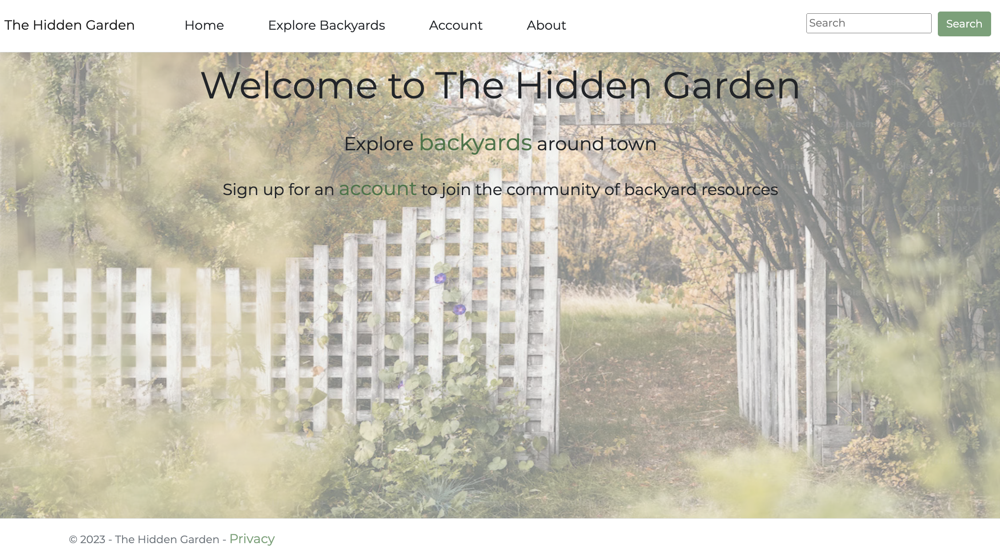

## 🍓 The Hidden Garden 🍓

#### By Molly Donegan, Sarah Andyshak, Erin Timlin, David Jandron, Kai Clausen, Asia Kaplanyan

#### An MVC website for sharing local gardens, calling on the HiddenGarden API.

## 🍐 Technologies Used 🍐 

* C#
* .NET
* ASP.Net
* Entity Framework
* HTML
* CSS

Sample screenshots from the site:

## 🫐 How To Run This Project 🫐

### Install Tools

This project was scaffolded using [`dotnet new`](https://learn.microsoft.com/en-us/dotnet/core/tools/dotnet-new).

Install the tools that are introduced in [this series of lessons on LearnHowToProgram.com](https://www.learnhowtoprogram.com/c-and-net/getting-started-with-c).

### 🫐 Set Up and Run the Hidden Garden API Project 🫐

First, following the instructions in the README of [this repo](https://github.com/kaisama92/HiddenGardenApi.Solution) to set up and run the HiddenGarden API.

### 🫐 Set Up and Run This Project 🫐

1. Clone this repo.
2. Open the terminal and navigate to this project's production directory called "HiddenGarden".
3. Within the production directory "HiddenGarden", run `dotnet watch run` in the command line to start the project in development mode with a watcher.
4. Open the browser to _https://localhost:7028/_. If you cannot access https://localhost:7028 it is likely because you have not configured a .NET developer security certificate for HTTPS. To learn about this, visit: [Redirecting to HTTPS and Issuing a Security Certificate](https://www.learnhowtoprogram.com/lessons/redirecting-to-https-and-issuing-a-security-certificate).

## 🫐 Known Bugs 🫐

* No known bugs.

## 🍓 License 🍓
Enjoy the site! If you have questions or suggestions for fixing the code, please contact me!

[MIT](https://github.com/kaisama92/HiddenGardenClient.Solution/blob/main/LICENSE)_

Copyright (c) 2023 Molly Donegan, Sarah Andyshak, Erin Timlin, David Jandron, Kai Clausen, Asia Kaplanyan